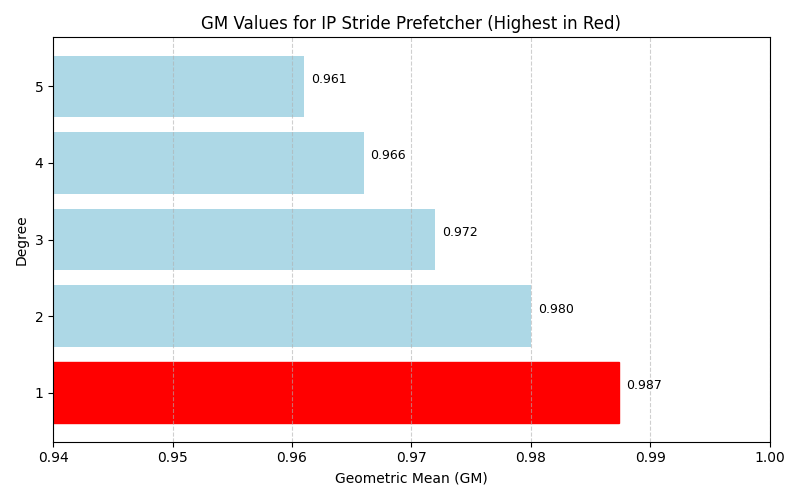
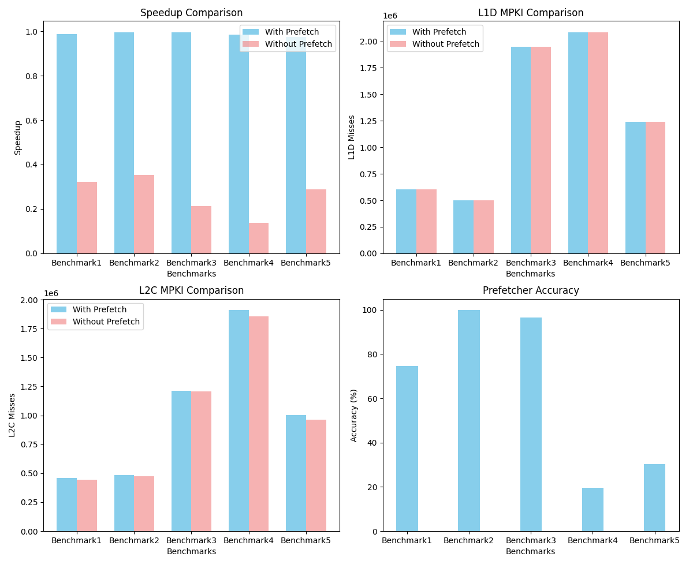

# Task 1: IP Stride Prefetcher (5 points)

## Description
In this task, we understand the IP Stride Prefetcher, a hardware prefetcher designed to improve cache hierarchy performance in computer systems. The prefetcher detects regular patterns in memory addresses accessed by instructions, predicts future memory accesses, and loads data into the cache before it's explicitly requested by the CPU.

## Understanding IP Stride Prefetcher

### IP Stride Detection
A stride refers to the regular interval between two sequentially accessed memory addresses. The IP Stride Prefetcher detects these stride patterns as instructions access memory and cache misses occur.

### Pattern Prediction
When a memory address is missed, the prefetcher predicts that an address offset by a certain distance from the missed address is likely to be accessed in the near future and the access pattern will
likely follow the same stride which the prefetcher learns. The prefetcher here learns the stride in 3 cache line misses.

### Prefetching
Once a stride pattern is detected, the prefetcher proactively fetches data from predicted memory addresses and loads it into the cache even before the CPU explicitly requests it.

## Plots
Here are the plots of speedups for varying degrees.

Degree = 1 provides the best speedup. ALl the parameters for degree = 1 are plotted below:

