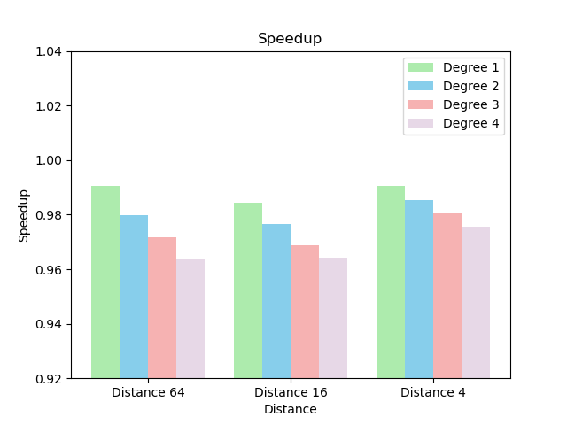
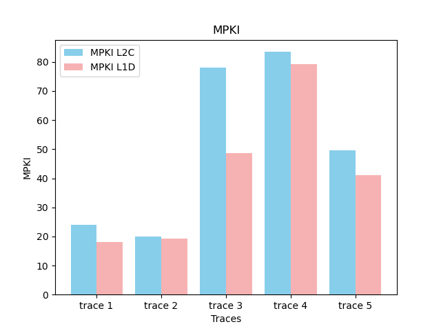
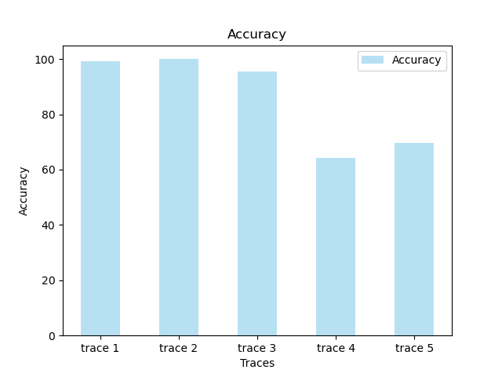

# Task 1: IP Stride Prefetcher 

## Description
In this task, we understand the IP Stride Prefetcher, a hardware prefetcher designed to improve cache hierarchy performance in computer systems. The prefetcher detects regular patterns in memory addresses accessed by instructions, predicts future memory accesses, and loads data into the cache before it's explicitly requested by the CPU. Note that there was an error in code provided by the TA, due to lack to the time all the data here is according to the erroreneous code. Our team has already contacted the TA about this and has told us to just use the old (errorenous) code.

## Understanding IP Stride Prefetcher

### IP Stride Detection
A stride refers to the regular interval between two sequentially accessed memory addresses. The IP Stride Prefetcher detects these stride patterns as instructions access memory and cache misses occur.

### Pattern Prediction
When a memory address is missed, the prefetcher predicts that an address offset by a certain distance from the missed address is likely to be accessed in the near future and the access pattern will
likely follow the same stride which the prefetcher learns. The prefetcher here learns the stride in 3 cache line misses.

### Prefetching
Once a stride pattern is detected, the prefetcher proactively fetches data from predicted memory addresses and loads it into the cache even before the CPU explicitly requests it.

## Plots
Here are the plots of speedups for varying degrees.

Degree = 1 provides the best speedup. All the parameters for degree = 1 are plotted below:

# Task 2: Stream Prefetcher Design and Analysis

We had to implement a 'Stream Prefetcher' with a fixed stream size of 64.  Note that there was an error in code provided by the TA, due to lack to the time all the data here is according to the erroreneous code. Our team has already contacted the TA about this and has told us to just use the old (errorenous) code.

## Implementation Details
The stream prefetcher is able to keep track of multiple dif-
ferent access streams. For each tracked access stream, a stream
tracking entry is created in the stream prefetcher. Each tracking
entry can be in one of four different states:

- **Invalid**: A tracking entry is not alloted a stream
- **Allocation**: A tracking entry is alloted a stream on a demand L2 miss
- **Training**: he prefetcher trains the direction (ascending or
descending) of the stream based on the next two L2 misses
that occur +/- 16 cache blocks from the first miss.4 If the
next two accesses in the stream are to ascending (descend-
ing) addresses, the direction of the tracking entry is set to 1
(0) and the entry transitions to Monitor and Request state.
- **Monitor and Request**

 **Warm-up and Simulation**: We had to run the simulation with the following settings:
  - `warmup_instructions = 25,000,000`
  - `simulation_instructions = 25,000,000`

## Analysis and Plots

### Overall Speedup

- Here are the plots of the overall speedup across all traces, comparing it to the baseline without prefetching.

### Optimal Prefetching Configuration

- Degree = 1, Distance = 4 provides the best speedup. All the parameters for it are plotted below:
 

# Task 3: Prefetch Throttling

Our whole model of dynamically controlling Prefetch parameters depend on 2 metrics (the paper suggested 3 but cache pollution was hard to implement). Please note that the implementation required changes in the Champsim interface & therefore to avoid any conflict we have made a different branch for it.
PF Accuracy: We calculated it by pf_useful/(pf_useful+pf_useless) even tho the problem statement stated it to b pf_useful/ pf_issued as our bounds were expecting high values which were suggested by the paper. So this value is updated on every cycle
PF Lateness: For this we needed late prefetches, this was hard to implement on the pf.cc code therefore we had to introduce a new variable in cache.h called pf_late which was incremented in cache.cc on MSHR hit but a cache miss.
Depending on these 2 values we have created a mapping similar to the paper.

|  Accuracy   |  Lateness  |  Aggression update |
--------------|------------|--------------------|
|  low      	|  Not late  |  -1        	      |
|  low      	|  late   	 |  1         	      |
|  mid      	|  Not late  |  0         	      |
|  mid      	|  late      |  1         	      |
|  high     	|  Not late  |  0         	      |
|  high     	|  late   	 |  1         	      |

### How to decide low/mid/high/late/not late?
I used the threshold values given in the paper and tweaked them a bit. The variables PF_Acc_hi/lo and PF_late_TH represent them.

### State of aggression are defined by 
Prefetch degree in ip_stride_throttling
Prefetch degree and distance in stream_throttling

State is updated every cycle.

### IP Stride Throttling
Prefetch degree is given a range from 1 to 7 and is directly correlated with aggression update.
Prefetch degree+=aggression update
With min and max bound fulfilled.

### Plots 
Here are the plots with respect to prefetcher perfomance of stream and ip_stride.

# Task 4 [BONUS]: Stream + stride Prefetcher Design and Analysis

We had to implement a 'Stream + Stride Prefetcher' with a fixed stream size of 64.  Note that there was an error in code provided by the TA, due to lack to the time all the data here is according to the erroreneous code. Our team has already contacted the TA about this and he has told us to just use the old (errorenous) code.

## Implementation Details
The implementation is similar to Task 2. But here training is complete when both stride and Stream is trained 

 **Warm-up and Simulation**: We had to run the simulation with the following settings:
  - `warmup_instructions = 25,000,000`
  - `simulation_instructions = 25,000,000`

## Analysis and Plots

### Overall Speedup

- Here are the plots of the overall speedup across all traces, comparing it to the baseline without prefetching.

### Optimal Prefetching Configuration

- Identify the prefetch degree and distance combination that yields the highest speedup.

  - Prefetch Degree: 1
  - Prefetch Distance: 4
 

